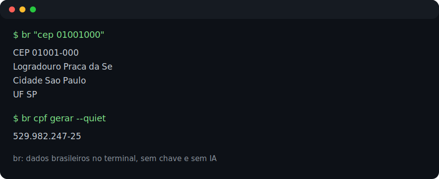

# br

[](https://github.com/addodelgrossi/br/actions/workflows/test.yml)
[](https://github.com/addodelgrossi/br/actions/workflows/release.yml)



`br` e uma CLI brasileira para devs que consultam dados publicos, validam documentos e geram massa de teste direto no terminal.

`curl` funciona, mas `br` lembra, normaliza e formata.

```bash
br "cep 01001000"
br "cpf gerar" --quiet
br "cnpj validar 11.222.333/0001-81" --json
```

## Instalacao

Linux/macOS via script:

```bash
curl -fsSL https://raw.githubusercontent.com/addodelgrossi/br/main/install.sh | sh
```

Instalar em outro diretorio:

```bash
curl -fsSL https://raw.githubusercontent.com/addodelgrossi/br/main/install.sh | BR_INSTALL_DIR=/usr/local/bin sh
```

Instalar uma versao especifica:

```bash
curl -fsSL https://raw.githubusercontent.com/addodelgrossi/br/main/install.sh | BR_VERSION=v0.1.0 sh
```

Com Go instalado:

```bash
go install github.com/addodelgrossi/br/cmd/br@latest
```

Do codigo-fonte:

```bash
git clone https://github.com/addodelgrossi/br.git
cd br
go install ./cmd/br
```

> Nota: o instalador via `curl` baixa os assets da pagina de releases do GitHub. Se ainda nao existir release publico, use `go install ./cmd/br` dentro do repositorio.

## Uso rapido

```bash
$ br "cep 01001000"
CEP         01001000
Logradouro  Praca da Se
Bairro      Se
Cidade      Sao Paulo
UF          SP

$ br "banco 341" --quiet
ITAU UNIBANCO S.A.

$ br "feriados 2026" --csv
date,name,type
2026-01-01,Confraternizacao mundial,national
```

## Exemplos para copiar

Consultas online:

```bash
br cep 01001000
br cnpj 00000000000191
br banco 341
br bancos --csv
br ddd 16
br ufs
br cidades SP
br feriados 2026
```

Utilitarios offline:

```bash
br cpf gerar
br cpf validar 529.982.247-25
br cpf formatar 52998224725
br cnpj gerar
br cnpj validar 11.222.333/0001-81
br cnpj formatar 04252011000110
```

Frase curta ou subcomando classico: os dois funcionam.

```bash
br "cep 01001000"
br cep 01001000
```

## Saidas para scripts

Tabela curta por padrao:

```bash
br cep 01001000
```

JSON para automacao:

```bash
br cep 01001000 --json
```

CSV para listas:

```bash
br feriados 2026 --csv
```

Valor principal para scripts:

```bash
br cpf gerar --quiet
```

## O que ele faz hoje

- Consulta CEP, CNPJ, bancos, DDD, feriados, UFs e municipios via BrasilAPI.
- Gera, valida e formata CPF offline.
- Gera, valida e formata CNPJ offline.
- Entende frases curtas como `br "cep 01001000"`.
- Mantem subcomandos classicos para quem prefere CLI tradicional.
- Nao usa IA, nao exige token e nao depende de API paga.

## Por que existe?

Todo dev brasileiro acaba precisando de CEP, CPF, CNPJ, municipio, codigo de banco, DDD ou feriado em algum momento: teste de cadastro, script de migracao, debug de integracao, seed de banco, suporte, planilha, endpoint interno.

`br` tenta deixar essas consultas em um lugar so, com um comando curto o bastante para virar habito.

## Roadmap bom para contribuicoes

- Cache local opcional para consultas online.
- Busca reversa de CEP quando houver fonte publica estavel.
- Saida `--template` para scripts e CI.
- Integracao com Homebrew.
- Mais fontes publicas brasileiras, mantendo a CLI simples.

## Desenvolvimento

```bash
go test ./...
go run ./cmd/br --help
go run ./cmd/br "cpf gerar"
```

Rodar exemplos com a BrasilAPI real:

```bash
go run ./cmd/br "cep 01001000" --json
go run ./cmd/br "banco 341" --quiet
go run ./cmd/br "feriados 2026" --csv
```

Build local:

```bash
go build -o bin/br ./cmd/br
./bin/br "cidades SP" --quiet
```

Release snapshot:

```bash
goreleaser release --snapshot --clean
```

Publicar release oficial:

```bash
git tag v0.1.0
git push origin v0.1.0
```

Ao publicar uma tag `v*`, o GitHub Actions roda o GoReleaser e anexa os binarios para Linux, macOS e Windows. O `install.sh` usa esses assets para instalar o comando `br`.

## Fonte dos dados

As consultas online usam a [BrasilAPI](https://brasilapi.com.br/). Os utilitarios de CPF/CNPJ rodam offline usando os algoritmos dos digitos verificadores.

## License

MIT
